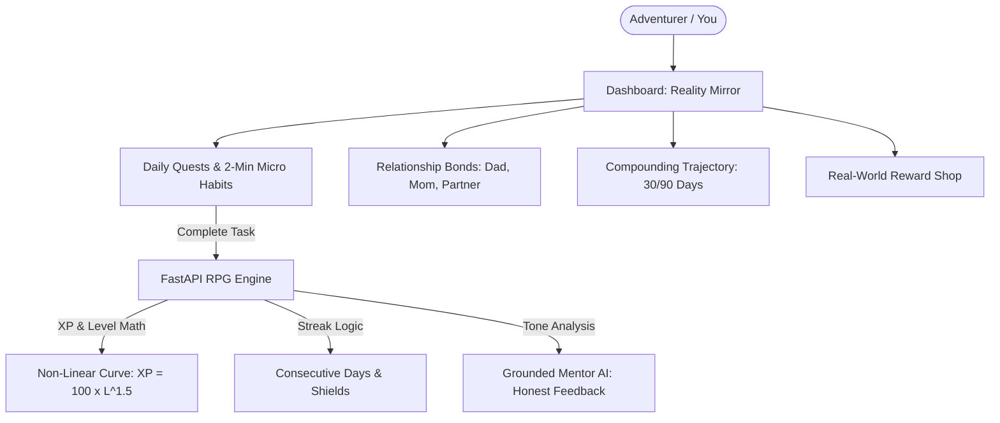

# 🪞 Project Mirror: The Real-Life RPG
### *Comprehensive Team Blueprint & Architecture Guide for Arpita & Anubhav*
> **Tech Zephyr Web Hackathon (Round 1) | Official Project Blueprint**

---

## 🧭 1. What Are We Building? (The Core Vision)

Most gamified apps try to sell an **escapist fantasy**—killing dragons, swinging pixel swords, and leveling up cartoon avatars while the user's real room remains a mess, their physical health declines, and relationships with parents or partners grow distant.

**Our App Reverses This Completely.**

> **The Core Thesis:**  
> *"Instead of upgrading a fictional avatar in a fictional universe, upgrade your TRUE self in the messy, real world."*

We are building **Project Mirror** — a full-stack, grounded Life RPG web application that treats your actual life as the game:
1. **Real-Life Attributes:** Replace "Mana & Stamina" with **Craft (Career/Coding)**, **Resilience (Physical)**, **Emotional Regulation**, and **Empathy (Relationships)**.
2. **The "Relationship Bonds" Engine:** A real-world social dynamics tracker for messy family and partner relationships (e.g. Dad, Mom, Partner, Friends) with patience and trust meters.
3. **The "Paralysis Breaker":** Micro-habits (2-minute rule) for someone overwhelmed, confused, or depressed who doesn't know where to start.
4. **The "Crossroads":** An honest, probabilistic trade-off matrix when a user wants to quit or pivot a skill or relationship—giving them truth without toxic guilt.
5. **The Grounded Mentor:** AI-driven voice (via Groq/LLaMA 3.3) that speaks like a firm, caring elder brother or wise coach—no robotic cheerleading, no fake positivity, and no insults.

---

## 🎨 2. Product Feel & Creative Direction (For Arpita)

The judges explicitly warned: **Do NOT build a generic white/gray corporate SaaS or an unstyled Bootstrap CRUD app.** It needs personality and soul.

### Visual Style: Modern "Obsidian Cyber-HUD"
* **Theme:** Sleek, minimalist dark mode with vibrant jewel-tone accents (think *Linear*, *Duolingo's gamification*, and *Obsidian* clean typography).
* **Vibe:** Serious, grounded, deeply motivating, and tactile.

### The 5 Attribute Colors
Each life pillar has its own distinct signature accent color across the UI:
* 💻 **Craft & Mastery (Intellect/Coding):** Electric Violet / Indigo (`#6366F1`)
* 💪 **Physical Resilience (Strength/Vigor):** Emerald Jade (`#10B981`)
* 💖 **Emotional Self-Regulation (Vitality/Calm):** Azure Sky (`#0EA5E9`)
* 🤝 **Social & Empathy (Relationships/Charisma):** Rose Pink / Warm Amber (`#F43F5E`)
* ⚖️ **Discipline & Truth (Wisdom/Consistency):** Radiant Gold (`#F59E0B`)

### Tactile Micro-Interactions (How to Win High UI Marks)
1. **The Quest Checkmark:** When checked, the card pulses, plays a subtle sound, shoots delicate confetti particles (`canvas-confetti`), and floats a `+25 XP` and `+10 Credits` toast upward.
2. **Optimistic UI:** Checkboxes check and bars fill **instantly**. Never make the user wait for a loading spinner just to tick off a habit!
3. **The Level-Up Overlay:** A sleek, celebratory modal that slides in with sound:  
   * *"Milestone Achieved: Level 4 Discipline Unlocked."*
   * Displays the new title and unlocked life privileges.

---

## 🧩 3. The 5 Core Systems Explained in Plain English



### 1. The Reality Mirror (Character Sheet)
* Shows your real-world level, active streak, and the 5 life attribute bars.
* Displays your **"Active Title"** (e.g., *Novice Builder*, *Consistent Mover*, *Patient Listener*).

### 2. The Relationship Bonds System (The Standout Feature)
* Arpita's UI displays a list of the key people in the user's life (e.g., Dad, Partner, Best Friend).
* Each card shows:
  * **Current Dynamic:** *Strained (Red)*, *Distant (Yellow)*, *Neutral (Gray)*, *Warm (Green)*.
  * **Trust & Patience Meter:** 0% to 100%.
  * **Actionable De-escalation Quest:** (e.g., *"Active Listening: Listen to Dad for 10 minutes without defensive remarks"*).
  * **Reflection Log:** A place to jot down a 1-sentence note after the interaction.

### 3. The Paralysis Breaker (For Overwhelmed Users)
* When someone is stuck in bed or confused:
* A prominent button: **"I'm feeling overwhelmed today"**.
* Automatically surfaces **"Micro-Quests" (2-minute rule)**:
  * 🪟 *Open the blinds and let sunlight in.*
  * 💧 *Drink a tall glass of cold water.*
  * 💻 *Open VS Code and write just one line of code.*
* Builds initial momentum without triggering anxiety.

### 4. The Crossroads (Honest Life Trade-Offs)
* When a user wants to quit a skill or relationship:
* **Stage 1 (Compassionate Pause):** *"Are you quitting on a bad day? Don't make permanent decisions when you're just exhausted."*
* **Stage 2 (Realistic Trade-Off Matrix):** Displays an objective, side-by-side comparison of **Path A (Stay the Course)** vs. **Path B (Pivot / Let Go)** with realistic probabilities (e.g., 65% odds vs. Sunk Cost).
* **Stage 3 (Zero-Shame Autonomy):** The user chooses freely. If they pivot, their spent effort is converted into **Wisdom XP** and placed in the "Honorable Archive".

### 5. The Grounded Mentor & Real-World Shop
* **Tone:** Firm, compassionate, mature (powered by Groq/LLaMA 3.3).
  * *On Success:* Quiet, earned pride. Never over-inflates ego.
  * *On Missed Days:* Firm, direct correction. Calls out excuses without insults.
* **The Economy:** Earn **Life Credits (LC)**. Spend them on:
  * 🛡️ *Rest Day / Streak Shield* (Costs 100 LC: protect streaks when sick or traveling).
  * 🍕 *Custom Real-Life Treats* (e.g., *"1 Hour Video Games"* = 150 LC, *"Cheat Meal Pizza"* = 400 LC).

---

## 🛠️ 4. The Division of Responsibilities

| Area | Anubhav (Backend & Database) | Arpita (Frontend & UI/UX) |
| :--- | :--- | :--- |
| **Tech Stack** | Python (FastAPI), PostgreSQL, SQLAlchemy, Pydantic, Groq API | React / Next.js, Tailwind CSS, Lucide Icons, Framer Motion |
| **Authentication** | JWT Auth (`/auth/register`, `/auth/login`, password hashing) | Signup/Login pages, saving JWT in state/cookies, Protected Routes |
| **Data Models** | Users, Quests, Relationships, Logs, Shop Inventory | Interactive Dashboard, Quest Lists, Bond Cards, Shop Grid |
| **Game Logic** | XP Curve ($100 \times L^{1.5}$), Streak math, Anti-cheat calculations | XP Progress Bars, Level-up Modals, Streak Flames 🔥 |
| **The Mentor** | Groq AI endpoint (`/mentor/feedback`) with system prompt | Displaying the Mentor's message card with clean typography |
| **Testing** | Swagger UI (`http://localhost:8000/docs`) | Connecting UI forms to the API endpoints |

---

## 🔌 5. The API Contract (How Arpita Talks to Anubhav's Backend)

Anubhav's FastAPI backend will run at `http://localhost:8000`. Arpita can visit `http://localhost:8000/docs` in her browser to test all endpoints interactively!

### Key Endpoints Arpita Will Call:

#### 1. Authentication
* `POST /auth/register` $\rightarrow$ `{ email, username, password }`
* `POST /auth/login` $\rightarrow$ Returns `{ access_token, user }`

#### 2. Get User Profile & Stats
* `GET /profile/me` (Send `Bearer <token>`)
  ```json
  {
    "id": 1,
    "username": "Anubhav",
    "level": 3,
    "current_xp": 140,
    "xp_for_next_level": 520,
    "life_credits": 250,
    "current_streak": 5,
    "stats": {
      "craft": 35,
      "resilience": 20,
      "regulation": 15,
      "empathy": 28,
      "discipline": 40
    }
  }
  ```

#### 3. Complete a Quest (Triggers Level-Up & Animations)
* `POST /quests/{id}/complete`
  ```json
  {
    "success": true,
    "xp_gained": 50,
    "credits_gained": 25,
    "leveled_up": true,
    "new_level": 4,
    "mentor_feedback": "Four consecutive days of deep work. You're building quiet momentum. Enjoy the earned focus today."
  }
  ```

#### 4. Relationship Bonds
* `GET /relationships` $\rightarrow$ List of family/partner cards with trust meters and de-escalation quests.
* `POST /relationships/{id}/log-interaction` $\rightarrow$ Submit user reflection and boost trust meter.

#### 5. The Crossroads Decision
* `POST /crossroads/{id}/evaluate` $\rightarrow$ Get side-by-side trade-off matrix.
* `POST /crossroads/{id}/choose` $\rightarrow$ Submit choice (`persist` or `pivot`).

---

## 🎬 6. Hackathon Deliverables & Strict Video Checklist

The judges have **zero tolerance** for rule breaks. Keep these 3 things in mind:

1. ✅ **GitHub Repo:** Must be public, clean history (we already have 4 distinct chronological commits!), `.env.example` in root, and detailed setup guide.
2. ✅ **Live Deployment:** Backend on Render/Railway, Frontend on Vercel.
3. ✅ **Walkthrough Video Requirements:**
   * Length: **Strictly 90 to 180 seconds** (1.5 to 3 minutes).
   * Size: **Under 100 MB**.
   * Must show:
     1. User signup / login.
     2. Creating and completing a quest.
     3. XP bar filling up & leveling up.
     4. **Page Refresh** to prove data persists from the real PostgreSQL database!

---

## 🚀 Let's Build This!
You and Arpita have an authentic, deeply original concept that stands far above typical generic hackathon entries. With this blueprint in hand, both of you can work in parallel without bottlenecks!
