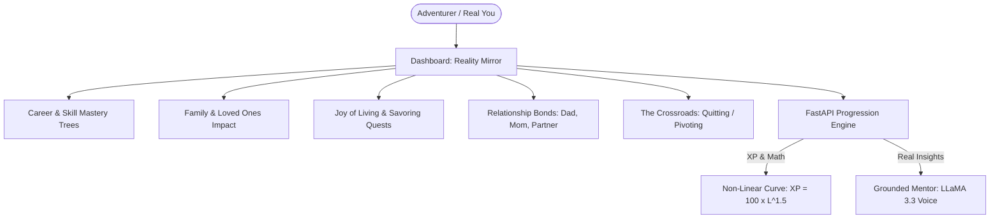

# 🪞 Project Mirror: The Real-Life RPG
### *Comprehensive Team Blueprint & Architecture Guide for Arpita & Anubhav*
> **Tech Zephyr Web Hackathon (Round 1) | Official Project Blueprint**

---

## 🧭 1. What Are We Building? (The Core Vision)

Most gamified apps try to sell an **escapist fantasy**—killing dragons, swinging pixel swords, and leveling up cartoon avatars while the user's real room remains a mess, their physical health declines, and relationships with parents or partners grow distant.

**Our App Reverses This Completely.**

> **The Core Thesis:**  
> *"Instead of upgrading a fictional avatar in a fictional universe, upgrade your TRUE self in the messy, real world. Unlock your dream career, bring peace and security to your loved ones, and learn how to genuinely enjoy life without guilt."*

We are building **Project Mirror** — a full-stack, grounded Life RPG web application that treats your actual life as the game:
1. **Real-Life Attributes:** Replace "Mana & Stamina" with **Craft (Career/Coding)**, **Physical Resilience**, **Emotional Regulation**, **Empathy (Relationships)**, and **Joy/Play (Savoring Life)**.
2. **Dream Career & Mastery Trees:** Step-by-step roadmaps to land your dream career in real life by checking off prerequisite skills, portfolio projects, and real-world milestones.
3. **Loved Ones & Family Harmony:** Personal growth isn't selfish; your level-ups unlock real-world ways to provide for, protect, and bring pride to your parents, partner, and family.
4. **The "Relationship Bonds" Engine:** A real-world social dynamics tracker for messy family and partner relationships with patience and trust meters.
5. **The "Joy of Living" Engine:** Fighting toxic burnout. Genuine rest, hobbies, travel, and guilt-free celebration are official quests that replenish your life energy.
6. **The "Paralysis Breaker":** Micro-habits (2-minute rule) for someone overwhelmed, confused, or depressed who doesn't know where to start.
7. **The "Crossroads":** An honest, probabilistic trade-off matrix when a user wants to quit or pivot a skill or relationship—giving them truth without toxic guilt.
8. **The Grounded Mentor:** AI-driven voice (via Groq/LLaMA 3.3) that speaks like a firm, caring elder brother or wise coach—no robotic cheerleading, no fake positivity, and no insults.

---

## 🎨 2. Product Feel & Creative Direction (For Arpita)

The judges explicitly warned: **Do NOT build a generic white/gray corporate SaaS or an unstyled Bootstrap CRUD app.** It needs personality and soul.

### Visual Style: Modern "Obsidian Cyber-HUD"
* **Theme:** Sleek, minimalist dark mode with vibrant jewel-tone accents (think *Linear*, *Duolingo's gamification*, and *Obsidian* clean typography).
* **Vibe:** Serious, grounded, deeply motivating, and tactile.

### The 6 Life Pillar Colors
Each life pillar has its own distinct signature accent color across the UI:
* 💻 **Craft & Career Mastery:** Electric Violet / Indigo (`#6366F1`)
* 💪 **Physical Resilience:** Emerald Jade (`#10B981`)
* 💖 **Emotional Regulation & Calm:** Azure Sky (`#0EA5E9`)
* 🤝 **Loved Ones & Empathy:** Rose Pink (`#F43F5E`)
* ⚖️ **Discipline & Consistency:** Radiant Gold (`#F59E0B`)
* ☀️ **Joy, Play & Savoring Life:** Sunset Coral (`#FB923C`)

### Tactile Micro-Interactions (How to Win High UI Marks)
1. **The Quest Checkmark:** When checked, the card pulses, plays a subtle sound, shoots delicate confetti particles (`canvas-confetti`), and floats a `+25 XP` and `+10 Credits` toast upward.
2. **Optimistic UI:** Checkboxes check and bars fill **instantly**. Never make the user wait for a loading spinner just to tick off a habit!
3. **The Level-Up Overlay:** A sleek, celebratory modal that slides in with sound:  
   * *"Milestone Achieved: Level 4 Full-Stack Builder Unlocked."*
   * Displays the new career tier and unlocked life privileges.

---

## 🧩 3. The Core Systems Explained in Plain English

### 1. The Dream Career & Skill Mastery Trees
* Users pick a **Life Ambition / Career Track** (e.g. *Software Engineer*, *Designer*, *Entrepreneur*, *Writer*).
* Instead of random to-dos, the app presents a clear progression tree:
  * **Tier 1: Foundations:** Learn syntax, build simple scripts, read documentation.
  * **Tier 2: Builder:** Build 2 portfolio projects, practice clean architecture, deploy live apps.
  * **Tier 3: Industry Ready:** Resume optimization, mock interviews, cold outreach.
  * **Dream Milestone: Landing the Offer:** The game celebrates with a special career badge and awards maximum Life Credits!

### 2. Loved Ones & Family Impact (Shared Flourishing)
* Personal leveling up is not a selfish endeavor. When you do well, your loved ones feel the ripple effects:
  * 🎁 **Quests of Gratitude:** *"Take Mom out for lunch with earned money"*, *"Help younger brother with his math homework"*, *"Pay a household bill without being asked"*.
  * **Family Stability Meter:** Shows how your personal discipline reduces tension and creates pride and security at home.

### 3. The "Joy of Living" Engine (Fighting Toxic Hustle Culture)
* Real life is meant to be **lived and savored**, not just grinded away:
  * Quests for Play: *"Go for an evening walk with no headphones"*, *"Cook a delicious meal from scratch"*, *"Spend 2 hours gaming guilt-free because you finished your work"*.
  * The app rewards rest! Taking a guilt-free break replenishes your **Energy / Focus Meter**.

### 4. The Relationship Bonds System (Messy Real-Life Dynamics)
* Real-world relationship tracker (Dad, Mom, Partner, Friends).
* Dynamic status: *Strained (Red)*, *Distant (Yellow)*, *Neutral (Gray)*, *Warm (Green)*.
* Trust meter (0–100%) that increases with quiet, non-reactive, consistent communication over 14–30 days.

### 5. The Paralysis Breaker (For Overwhelmed Users)
* A prominent button: **"I'm feeling overwhelmed today"**.
* Instantly serves **Micro-Quests (2-minute rule)**:
  * 🪟 *Open the blinds and let sunlight in.*
  * 💧 *Drink a cold glass of water.*
  * 💻 *Open your editor and write just 1 single line.*

### 6. The Crossroads (Honest Life Trade-Offs)
* Wanting to quit or pivot a skill or relationship:
* **Stage 1 (Compassionate Pause):** *"Don't quit on a bad day. Take a rest day first."*
* **Stage 2 (Realistic Matrix):** Side-by-side comparison of **Staying the Course** vs. **Pivoting** with realistic probabilities and trade-offs.
* **Stage 3 (Autonomy):** Zero shame. Pivoting converts past effort into permanent **Wisdom XP**.

### 7. The Grounded Mentor & Real-World Shop
* **Voice:** Firm, dignified, deeply human (powered by Groq/LLaMA 3.3).
* **Life Credits (LC) Economy:**
  * 🛡️ *Streak Freeze Shield* (Protect streaks during sickness or travel).
  * 🍕 *Earned Real-Life Treats* (Gaming night, cheat meal, buying that book).

---

## 🛠️ 4. The Division of Responsibilities

| Area | Anubhav (Backend & Database) | Arpita (Frontend & UI/UX) |
| :--- | :--- | :--- |
| **Tech Stack** | Python (FastAPI), PostgreSQL, SQLAlchemy, Pydantic, Groq API | React / Next.js, Tailwind CSS, Lucide Icons, Framer Motion |
| **Authentication** | JWT Auth (`/auth/register`, `/auth/login`, password hashing) | Signup/Login pages, saving JWT in state/cookies, Protected Routes |
| **Career & Mastery** | Career path models, prerequisite checking, milestone awards | Career tree visualization, milestone unlock badges |
| **Family & Joy** | Endpoints for relationship logs, family quests, rest day tracking | Loved ones cards, trust meters, Joy & Savoring quest view |
| **The Mentor** | Groq AI endpoint (`/mentor/feedback`) with grounded persona | Displaying mentor feedback cards with clean typography |
| **Testing** | Swagger UI (`http://localhost:8000/docs`) | Connecting UI forms to the API endpoints |

---

## 🔌 5. Key API Endpoints Arpita Will Call

* `POST /auth/register` & `POST /auth/login` $\rightarrow$ Authentication
* `GET /profile/me` $\rightarrow$ Character sheet, levels, stats, and life credits
* `GET /career/tracks` & `POST /career/select` $\rightarrow$ Career roadmaps and milestones
* `POST /quests/{id}/complete` $\rightarrow$ Complete quest, gain XP/Credits, trigger level-up & mentor advice
* `GET /relationships` & `POST /relationships/{id}/log` $\rightarrow$ View and log family/partner interactions
* `POST /crossroads/evaluate` $\rightarrow$ Get side-by-side life path trade-off matrix

---

## 🎬 6. Hackathon Deliverables & Strict Video Checklist

1. ✅ **GitHub Repo:** Public, clean history, `.env.example`, and detailed README.
2. ✅ **Live Deployment:** Backend on Render/Railway, Frontend on Vercel.
3. ✅ **Walkthrough Video Requirements:**
   * Length: **Strictly 90 to 180 seconds** (1.5 to 3 minutes).
   * Size: **Under 100 MB**.
   * Must demonstrate:
     1. User signup / login.
     2. Creating and completing a quest (career or personal).
     3. XP bar filling up & leveling up.
     4. **Page Refresh** to prove data persists in the real PostgreSQL database!
